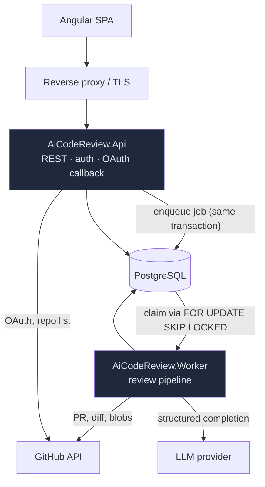
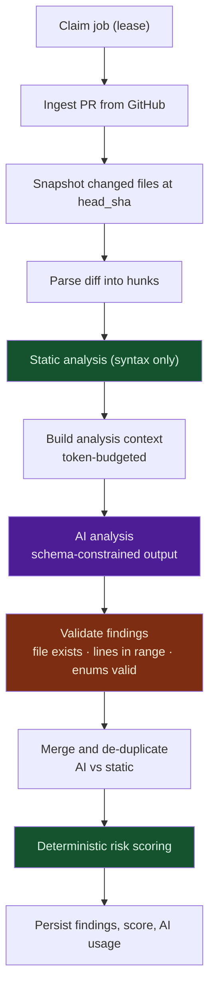

# Architecture Overview

## Shape

A modular monolith with two deployable entry points that share one Application
and Infrastructure layer, plus one PostgreSQL database ([ADR-001](../adr/001-modular-monolith-with-separate-worker.md)).



The API and Worker never reference each other. They meet at the job queue.

## Layering

```
Domain          -> (nothing)
Application     -> Domain
Infrastructure  -> Application, Domain
Api / Worker    -> Application, Infrastructure   (composition root only)
```

| Project | Holds | Never holds |
|---------|-------|-------------|
| `Domain` | Entities, value objects, enums, risk scoring, `Result`/`Error` | Any framework, ORM, HTTP or package reference |
| `Application` | Use cases, ports (`IGitHubClient`, `IAiProvider`, `IJobQueue`), review pipeline, context building, AI output validation | Concrete adapters, SDKs, SQL |
| `Infrastructure` | EF Core, GitHub adapter, job queue, token protection | Knowledge of a host |
| `Api` | Endpoints, auth, DTOs, ProblemDetails mapping | Business rules |
| `Worker` | Job dispatcher, pipeline handlers | Business rules |

These rules are executable, not aspirational — see
`tests/AiCodeReview.ArchitectureTests`. A violation fails the build.

`Api` and `Worker` reference `Infrastructure`, but only `Program.cs` may use it.
`CompositionRootTests` scans the source to enforce that, because an
assembly-level rule cannot express it.

## Review pipeline

The LLM is one stage inside a mostly deterministic pipeline, not the pipeline
itself.



Green is deterministic, purple is the model, orange is the guard between them.
No model output reaches the database without passing validation, and the model
never sets the risk score ([ADR-008](../adr/008-deterministic-risk-scoring.md)).

## Cross-cutting decisions already in place

- **Failures are values.** `Result`/`Error` in `Domain.Common`, mapped to
  ProblemDetails in exactly one place ([ADR-003](../adr/003-result-pattern-for-expected-failures.md)).
- **Exceptions never reach the client.** `GlobalExceptionHandler` logs in full
  and returns an opaque 500 with a `traceId`.
- **Every request is correlated.** `CorrelationIdMiddleware` accepts an inbound
  `X-Correlation-Id` only after validating it — an unvalidated header is a log
  injection vector — and pushes it onto the logging scope.
- **Liveness and readiness are different questions.** `/health` reports whether
  the process is up and deliberately checks no dependencies, so a failing
  database cannot cause an orchestrator to kill a healthy instance.
  `/health/ready` runs dependency checks tagged `ready`.

## Current state

Implemented: the layering, the guardrails and the two hosts.
Not yet implemented: everything the pipeline diagram describes. Milestones are
tracked in the root [README](../../README.md).
